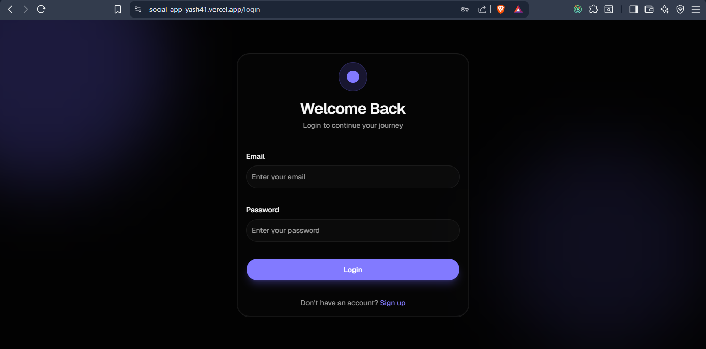
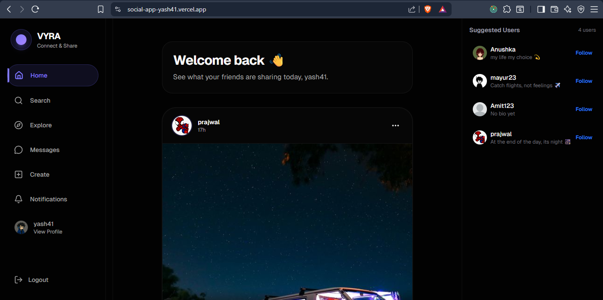
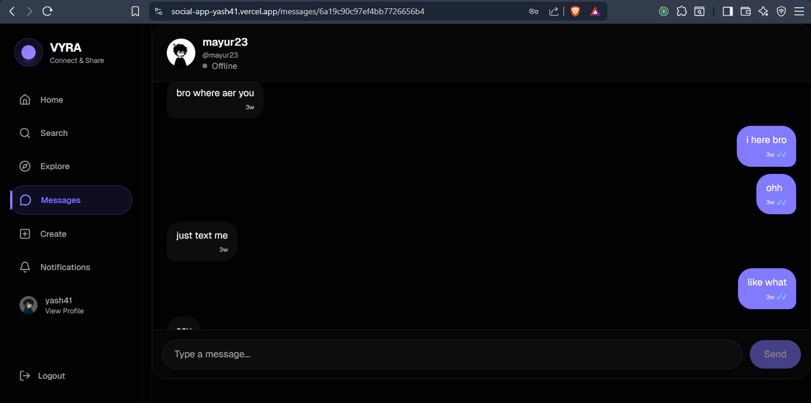
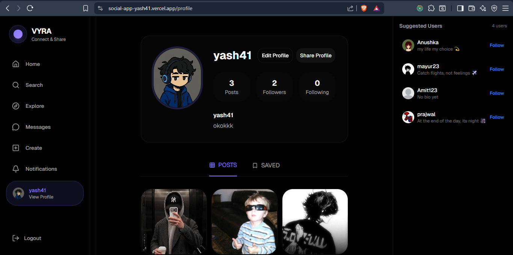

# 📱 Social Media App

A full-stack social media web application built using the MERN stack where users can register, login, create posts, interact with others, and chat in real time.

## 🚀 Live Demo

Frontend:
https://social-app-yash41.vercel.app

Backend:
https://social-media-app-7gwu.onrender.com

---

## ✨ Features

- User Authentication (JWT + Cookies)
- User Registration & Login
- Create Posts
- Like Posts
- Comment on Posts
- Follow / Unfollow Users
- Real-Time Chat using Socket.IO
- Notifications
- Responsive UI
- Secure Authentication
- Protected Routes

---

## 🛠 Tech Stack

### Frontend

- React 19
- Vite
- Redux Toolkit
- React Router
- Axios
- Tailwind CSS
- ShadCN UI

### Backend

- Node.js
- Express.js
- MongoDB
- Mongoose
- JWT
- Bcrypt
- Socket.IO
- Cookie Parser

### Deployment

- Frontend → Vercel
- Backend → Render
- Database → MongoDB Atlas

---

## 📂 Project Structure

```
frontend/
backend/
```

---

## 📸 Screenshots

### Login



### Home



### Chat



### Profile



---

## ⚙ Installation

Clone the repository

```bash
git clone <repository-url>
```

Install frontend dependencies

```bash
cd frontend
npm install
```

Install backend dependencies

```bash
cd backend
npm install
```

Run frontend

```bash
npm run dev
```

Run backend

```bash
npm run dev
```

---

## 🔐 Environment Variables

Backend

```env
PORT=

MONGO_URI=

JWT_SECRET=

CLIENT_URL=
```

Frontend

```env
VITE_API_URL=
```

---

## 📦 Deployment

Frontend deployed on Vercel

Backend deployed on Render

MongoDB Atlas used as the cloud database.

---

## 📚 What I Learned

- JWT Authentication
- Cookie-based Authentication
- REST APIs
- Redux Toolkit
- MongoDB Relationships
- Socket.IO
- MERN Deployment
- Environment Variables
- CORS Configuration

---

## 🚀 Future Improvements

- Image Uploads with Cloudinary
- Stories Feature
- Video Posts
- Search Users
- Group Chats
- Email Verification
- Password Reset

---

## 👨‍💻 Author

Yash

GitHub:
(Add GitHub Link)

LinkedIn:
(Add LinkedIn Link)
